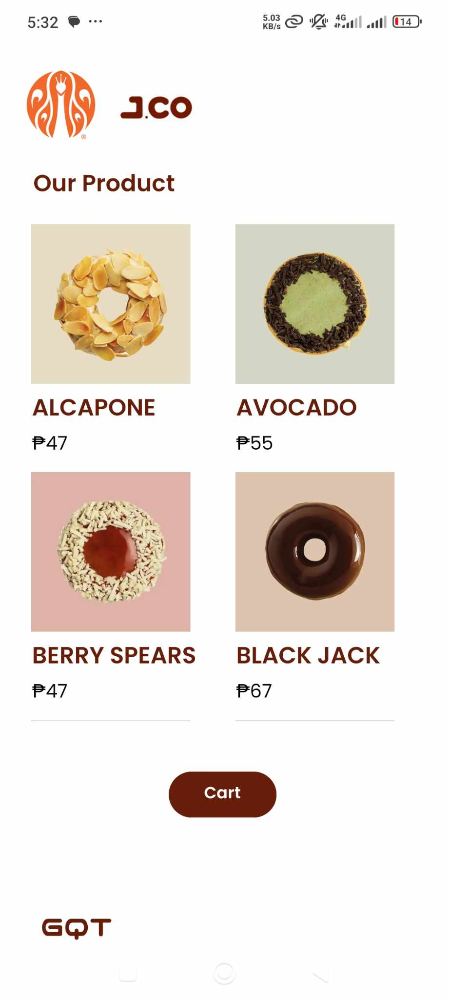
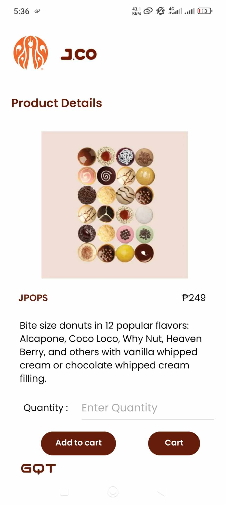
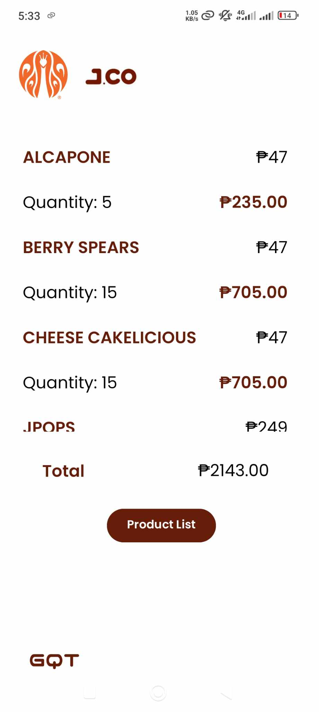

# Android-App-POS-Simulation-JCO-
Finals Exercise #1 for our App Development Course. A simulation of an e-commerce point of sale system. Users can view the product offerings, add a product to the cart and view the items in the cart. This app features 8 of JCO Donuts and Coffee's product offerings.

<h1>The App's Main Interface Showing the Product Offerings</h1>

#The App's Product Description UI

#The App's Cart View

